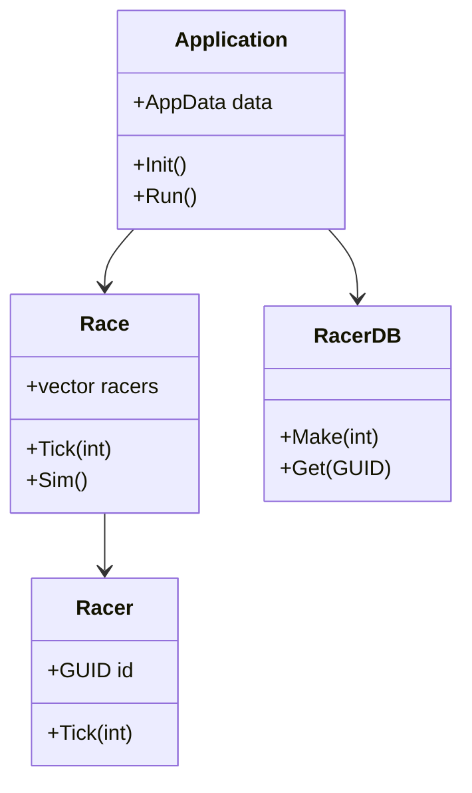
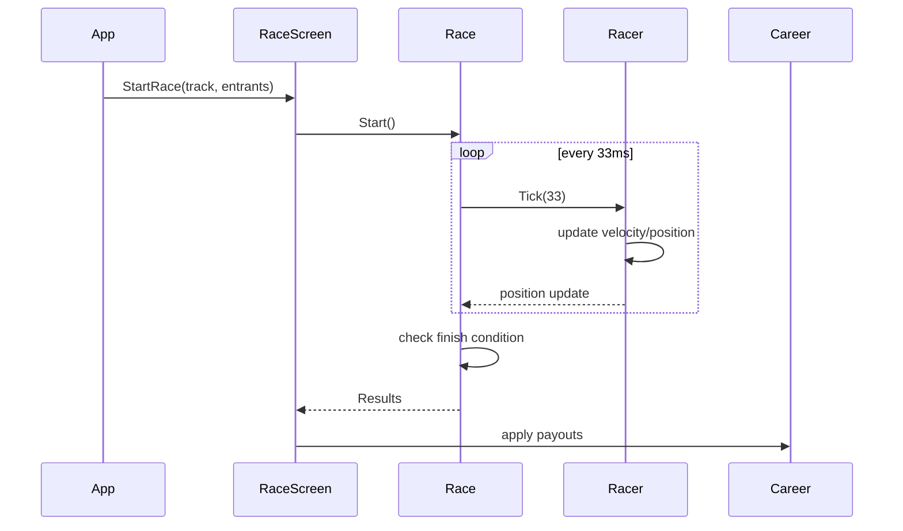

# SportsRace — Game Design Document (reverse-engineered)

Last updated: 2026-09-06T19:33:05+01:00
Source: reverse-engineered from codebase at C:\coding\coding\SportsRace
Author: Automated reverse-engineering (summary by developer assistant)

---

## 1. Elevator pitch
SportsRace is a lightweight, arcade-style 2D sprint racing simulation where a field of AI racers compete on configurable short tracks. The game emphasizes quick races, simple strategic tuning (skills/cutoffs), career progression, and replayable deterministic simulation for testing and balance.

## 2. Target platforms & tech stack
- Primary: Windows (Visual Studio C++ projects)
- Libraries: SDL (windowing/input), SDL_image, SDL_ttf, SDL_mixer, spdlog
- Language: C++20 (project uses /std:c++20)

## 3. High-level concept and loop
- Player chooses or creates a racer and enters Career or Quick Race.
- Core loop: simulate race ticks (≈33ms per step), update racer velocities/positions, determine finishing order, award prizes, update career finances and progression.

Core runtime flow (simplified):
- Application::Init() -> load assets & config -> ScreenStack.Push(MainMenu)
- Main loop: while (!App.Halted) { IO.Update(); ScreenStack.Update(); Renderer.Render(); }

## 4. Key features
- Fast, deterministic race simulation (seedable RNG) — currently uses rand(); recommended replace with std::mt19937.
- Racer attributes and skills: BaseSpeed, StandardVelocity, Sprint, Luck, cutoffs.
- Multiple track lengths: 100/200/250/500/1000 (units are internal pixels/units).
- Career mode with persistent finances and database of racers.
- Minimal UI: Main Menu, Race Screen, Career Hub, Racer Detail, Ranking.
- Lightweight audio: hover/click sound effects, music tracks per scene.
- Custom micro test harness and unit tests covering core simulation.

## 5. Systems decomposition
- Application / AppData: global state, screen stack, configuration, RNG seed.
- IO: input polling (SDL events), mouse/keyboard abstraction.
- Render: per-screen renderers, texture/font cache, layer ordering.
- Audio: sound/music wrapper around SDL_mixer.
- Race simulation: Race, Racer, Track, RaceResult, RaceFinancials.
- Career: RacerDB, CareerProfile, CareerData (player progression, money).
- Util: logging (spdlog), GUID generator, name maker.

## 6. Data model / primary classes
Below are condensed class sketches (fields + essential methods) mapped from code.

Racer (src/Racer.h/cpp)
- Fields: GUID id; string name; int posX; double velocity; uint64_t currentTick; RacerSkills skills; bool finished; int finishMs; 
- Methods: Reset(); Tick(deltaMs); GetPosition(); IsFinished();

RacerSkills
- Fields: double baseSpeed; double standardVelocity; double sprint; double luck; int sprintCutoff; int standardCutoff;
- Methods: randomize(seed?)

Race (src/Race.h/cpp)
- Fields: vector<Racer*> racers; Track* thisTrack; uint64_t currentTick; RaceStatus status; vector<RacerRaceResult> results; RaceFinancials financials;
- Methods: Tick(deltaMs); Sim(); GetByRank(rank); AddRacer(r); Start(); Finished();

Track
- Fields: string id; int length; metadata (name, difficulty)

RacerDB
- Fields: unordered_map<GUID,Racer> map; vector<Racer> pool;
- Methods: Make(count); Get(guid); Contains(guid)

CareerProfile / CareerData
- Fields: Racer playerRacer; int cash; vector<Trophies>; progress
- Methods: EnterRace(track); UpdateAfterRace(results)

CommandLineParser (src/App/CommandLine.hpp)
- Parses argv tokens into flags and optional args (supports -, /, and --opt)

RaceFinancials
- Fields: int firstPlacePrize; int secondPlace; int thirdPlace; int entranceFee; 
- Methods: calculatePayouts();

## 7. Class diagram (Mermaid)

## 8. Sequence diagram: running a race (Mermaid)

## 9. UI Flow / Screens
- Main Menu: New Career, Quick Race, Options, Exit
- Career Hub: Player profile, available races, finances, shop (not implemented yet)
- Race Screen: race render, positions, lap/timer, HUD (place, time)
- Racer Screen: view racer stats, cosmetics (name only), history
- Ranking Screen: post-race placements and payouts

User input mapping (typical):
- Mouse: UI interaction (buttons)
- Keyboard: Esc = back/exit, arrows for menu nav (limited), space to skip or pause

## 10. Economics & progression (derived)
- EntranceFee and FirstPlacePrize exposed from RaceFinancials
- Career starts with Cash = 5000
- Win/Place payouts modify CareerProfile cash
- Suggested progression design: tracks unlock via cash or ranking, add sponsorship rewards, and long-term upgrades for skills

## 11. Tuning & Balance
- Race outcome heavily depends on RacerSkills and cutoffs. Important tuning knobs:
  - BaseSpeed scaling (affects velocity magnitude)
  - Cutoff thresholds (where racers switch between sprint/standard behavior)
  - Randomness (Luck contribution)
  - Track length (affects relative advantage for sprint vs endurance)

Testing suggestions:
- Unit tests to assert GetByRank ordering across tie scenarios.
- Deterministic sim tests using seeded RNG to validate finishing order for fixed skill sets.
- Fuzz tests for edge cases (zero-length track, identical skills, single entrant).

## 12. Known issues & observations
- RNG: uses C rand(); not seedable via config by default (seeded by time in Application ctor).
- Memory: raw new allocations for long-lived objects (Track, CareerProfile, CareerData) with unclear deletion — recommend smart pointers.
- Name generation: uses rand() % (size - 1) which is off-by-one (excludes last element) — fix to rand() % size.
- MSBuild toolset mismatch: solution targets older platform toolset (v143/v140) causing CI/build issues on some machines.
- spdlog enforces /utf-8 at compile time — ensure compile flags include /utf-8.

## 13. Migration & remediation checklist (prioritized)
1. Deterministic RNG (High)
   - Replace rand()/srand with std::mt19937 seeded from CLI or config. Add `--seed N` command-line option to force determinism for testing and replay.
   - Update tests to use the new RNG where appropriate.

2. Ownership & memory safety (High)
   - Replace raw pointers for long-lived objects with std::unique_ptr or shared_ptr as appropriate.
   - Audit all `new` calls and add RAII wrappers or ensure clear ownership and proper destruction at application shutdown.

3. Fix off-by-one in name generation (Medium)
   - Change rand() % (size - 1) -> rand() % size (or use uniform_int_distribution).

4. Improve test coverage & framework (Medium)
   - Option A: Retain micro harness (works) but add more tests for edge cases and deterministic sim.
   - Option B: Migrate to GoogleTest and integrate with Visual Studio test adapter and CI.

5. CI and toolset (High)
   - Update solution or CI pipeline to either install Visual Studio Build Tools v143 or retarget solution to currently available toolset.
   - Add CI job to build tests and run test executable; mark failures as blocking.

6. Code quality & logging (Low/Medium)
   - Use fmt-style logging consistently; avoid string concatenation for numeric types.
   - Add unit tests for command-line parsing, config loading, and logging level mapping.

7. Assets & packaging (Low)
   - Add script to verify external media presence and copy required assets to output dir during CI.

## 14. Implementation roadmap (phases & rough priorities)
- Phase 1 (1–2 days): Seeded RNG, name gen fix, small deterministic tests. Update tests to pass on new RNG.
- Phase 2 (2–3 days): Replace raw pointers with smart pointers across AppData, CareerData, Track. Fix obvious leaks and add destructor cleanup.
- Phase 3 (3–5 days): CI setup (build tools, run tests), retarget solution or adjust CI image to match toolset, integrate unit tests into CI.
- Phase 4 (2–4 days): Optional: migrate to GoogleTest, add automated integration tests (full app run headless with mocked renderer/audio), add replay recording.

## 15. Example design details and API suggestions
- RNG API:
  - class Random { private: std::mt19937 eng; public: Random(uint32_t seed=seed_from_time()); double Uniform(); int Int(int a, int b); };
- Race tick determinism:
  - Separate "simulation" RNG instance per Race to allow parallel deterministic sims.
- Data persistence:
  - Save CareerProfile as JSON or simple binary; include seed + race seeds to replay exact race.

## 16. Testing checklist (immediate unit tests to add)
- Deterministic race: with seeded RNG and two racers with known skills, assert finishing order and finish times.
- Boundary track lengths: 0, 1, huge lengths — ensure no division/mod-by-zero.
- NameMaker: ensure all names reachable by generation.
- Race.GetByRank: ties, single racer, empty race.
- CommandLineParser: handle /cfg, -log, --seed, positional args, quoted paths.

## 17. Open questions / decisions to make
- Intended target platform other than Windows? (Linux/Mac would require SDL config and build adjustments.)
- Desired determinism level: per-race seed or global seed? Per-race preferred for replay granularity.
- Persistent storage format for career saves (JSON recommended for portability).

## 18. Appendix: Development commands & quick start (dev machine)
- Build tests locally (if Visual Studio toolset installed): open solution in Visual Studio 2022/2026 and select the test project `SportsRaceTest` then Build -> Run Tests.
- Alternative CLI build (when msbuild toolset unavailable):
  - Open x64 Native Tools Command Prompt (vcvars64.bat)
  - cl /std:c++20 /utf-8 /Iexternal /Isrc tests\Main.cpp src\Race.cpp src\Racer.cpp /Fe:tests\SportsRaceTest.exe
  - Run tests: tests\SportsRaceTest.exe

## 19. Contact & next steps offered
Next deliverables available on request:
- Commit migration changes: seeded RNG + tests + name gen fix.
- Smart pointer replacement PR (incremental changes per file).
- CI pipeline manifest (GitHub Actions) to build and run tests on Windows runner and a Linux runner (optional).
- Full GoogleTest migration and integration.

---

End of Document.
